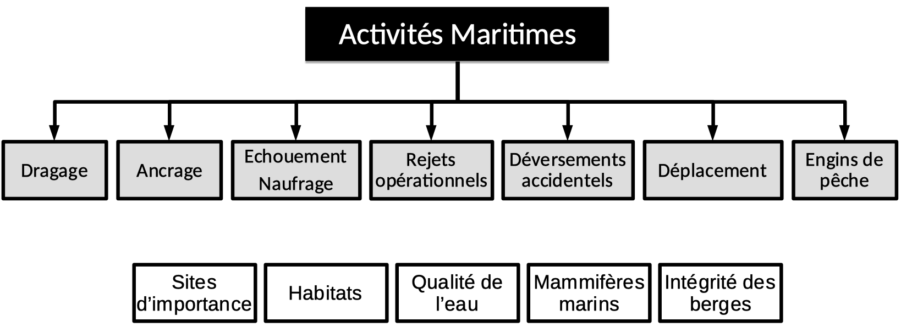
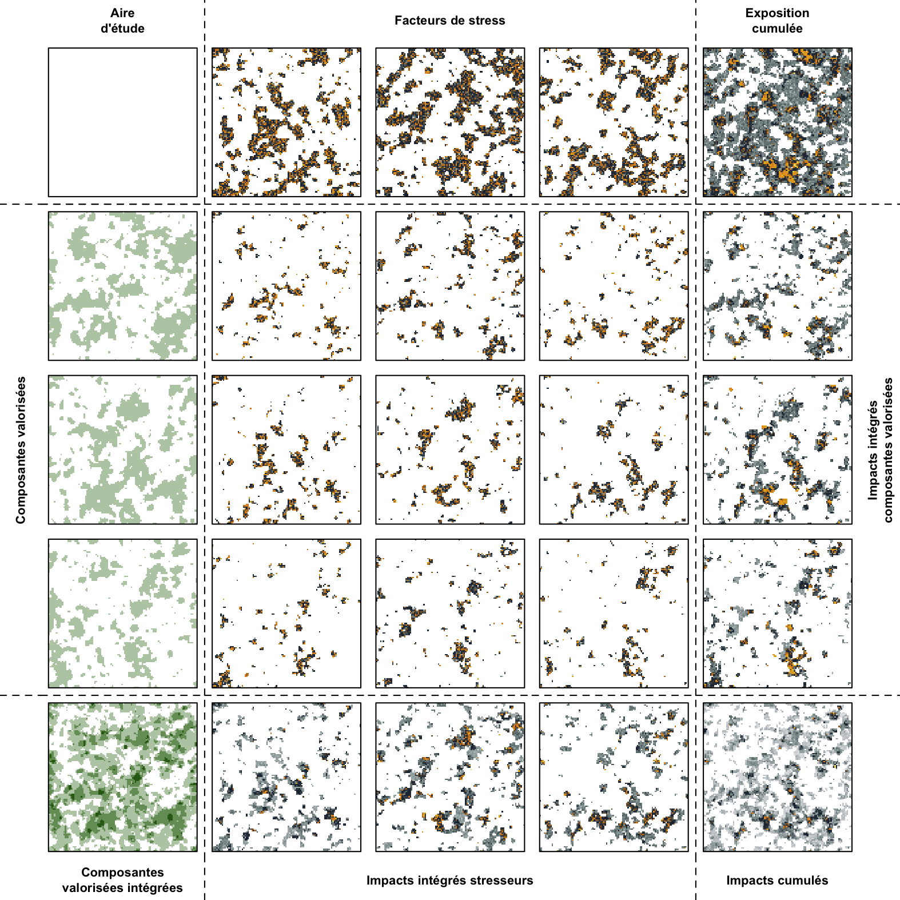

```{r setup, include=FALSE}
source('_setup.R')
# knitr::clean_cache(TRUE)
htmltools::tagList(
  xaringanExtra::use_clipboard(
    button_text = "<i class=\"fa fa-clipboard\"></i>",
    success_text = "<i class=\"fa fa-check\" style=\"color: #37abc8\"></i>",
  ),
  rmarkdown::html_dependency_font_awesome()
)
# xaringanExtra::use_scribble()

cols <- c('#777777','#d66666','#f0f518','#2eb8dd','#6a8868')
```


class: title-slide, middle


# Cumulative Effects of Marine Vessel Activities in the St. Lawrence River and the Saguenay River

<center></img></center>


<center><i>David Beauchesne, Cindy Grant & Philippe Archambault</i></center>

<span class="br2"></span>

<center>
<a href="https://www.ulaval.ca/"></img></a>
&nbsp;&nbsp;&nbsp;&nbsp;&nbsp;&nbsp;&nbsp;&nbsp;&nbsp;&nbsp;
</img>
<!-- &nbsp;&nbsp;&nbsp;&nbsp;&nbsp;
</img> -->
</center>

### Webinar on progress made

<span class="br2"></span>

#### 2021-04-21

#### [Version française](https://effetscumulatifsnavigation.github.io/2021-04-21-TC-WebinaireAvancement/)

---


class: inverse, center, middle

# Team

<html><div style='float:left'></div><hr color='#ffdd55' style="margin-top:-30px" size=1px width=720px></html>

---

# Team

<br/>

<center>
<div class="divTable team">
<div class="divTableBody">
<div class="divTableRow">
<div class="divTableCell">

</div><div class="divTableCell">

</div><div class="divTableCell">

</div></div>
<div class="divTableRow">
<div class="divTableCell"><b>David Beauchesne</b></div><div class="divTableCell"><b>Cindy Grant</b></div><div class="divTableCell"><b>Philippe Archambault</b></div></div>
</div>
</center>


---

class: inverse, center, middle

# Cumulative effects assessment

<html><div style='float:left'></div><hr color='#ffdd55' style="margin-top:-30px" size=1px width=720px></html>

---


# Cumulative effects assessment

.references[
Loi canadienne sur l'évaluation environnementale (1992)
]

**Impact assessment** : *assessment of the effects of a designated project that is conducted in accordance with the Impact Assessment Act (Canada).‍‍*

--

**Cumulative effects** : *[...] effects that are likely to result from the project in combination with other projects or activities that have been or will be carried out.*

--

**Cumulative effects assessment** : *systematic process that aims to identify, analyze and assess cumulative effects.*

<!--
https://www.parl.ca/DocumentViewer/fr/42-1/projet-loi/C-69/sanction-royal
https://www.canada.ca/fr/agence-evaluation-impact/services/politiques-et-orientation/evaluation-regionale-la-loi-evaluation-impact.html
-->


---

class: inverse, center, middle

# Steps

<html><div style='float:left'></div><hr color='#ffdd55' style="margin-top:-30px" size=1px width=720px></html>

---

# Steps

1. Identify, involve and communicate with stakeholders, Indigenous and non-Indigenous communities

--
2. Scope of the assessment <!-- (objectifs, limites, activités, facteurs de stress, composantes valorisées) -->

--
3. Profile of the study area
    * Activities and environmental stressors
    * Valued components
    * Vulnerability
--
4. Cumulative effects assessment

--
5. Diagnosing the analysis

--
6. Decision-making processes

--
7. Monitoring and adaptive management


---

# Steps

1. **<span style="color:#c13319;">Identify, involve and communicate with stakeholders, Indigenous and non-Indigenous communities</span>**
2. Scope of the assessment
3. Profile of the study area
    * Activities and environmental stressors
    * Valued components
    * Vulnerability
4. Cumulative effects assessment
5. Diagnosing the analysis
6. Decision-making processes
7. Monitoring and adaptive management

<p style="font-size:17px; line-height:1.4">
<i class="fas fa-arrow-circle-right" style="color:#c13319;"></i> Throughout the whole process
</p>


---

# Steps

1. <span style="color:#c13319;">Identify, involve and communicate with stakeholders, Indigenous and non-Indigenous communities</span>
2. **<span style="color:#1989c1;">Scope of the assessment</span>**
3. Profile of the study area
    * Activities and environmental stressors
    * Valued components
    * Vulnerability
4. Cumulative effects assessment
5. Diagnosing the analysis
6. Decision-making processes
7. Monitoring and adaptive management

<p style="font-size:17px; line-height:1.4">
<i class="fas fa-arrow-circle-right" style="color:#c13319;"></i> Throughout the whole process <br/>
<i class="fas fa-arrow-circle-right" style="color:#1989c1;"></i> Previously identified
</p>

---

# Steps

1. <span style="color:#c13319;">Identify, involve and communicate with stakeholders, Indigenous and non-Indigenous communities</span>
2. <span style="color:#1989c1;">Scope of the assessment</span>
3. **<span style="color:#FECA2C;">Profile of the study area</span>**
    * **<span style="color:#FECA2C;">Activities and environmental stressors</span>**
    * **<span style="color:#FECA2C;">Valued components</span>**
    * **<span style="color:#FECA2C;">Vulnerability</span>**
4. **<span style="color:#FECA2C;">Cumulative effects assessment</span>**
5. **<span style="color:#FECA2C;">Diagnosing the analysis</span>**
6. Decision-making processes
7. Monitoring and adaptive management

<p style="font-size:17px; line-height:1.4">
<i class="fas fa-arrow-circle-right" style="color:#c13319;"></i> Throughout the whole process<br/>
<i class="fas fa-arrow-circle-right" style="color:#1989c1;"></i> Previously identified<br/>
<i class="fas fa-arrow-circle-right" style="color:#FECA2C;"></i> Work performed by our team
</p>


---

# Steps

1. <span style="color:#c13319;">Identify, involve and communicate with stakeholders, Indigenous and non-Indigenous communities</span>
2. <span style="color:#1989c1;">Scope of the assessment</span>
3. <span style="color:#FECA2C;">Profile of the study area</span>
    * <span style="color:#FECA2C;">Activities and environmental stressors</span>
    * <span style="color:#FECA2C;">Valued components</span>
    * <span style="color:#FECA2C;">Vulnerability</span>
4. <span style="color:#FECA2C;">Cumulative effects assessment</span>
5. <span style="color:#FECA2C;">Diagnosing the analysis</span>
6. **<span style="color:#999999;">Decision-making processes</span>**
7. **<span style="color:#999999;">Monitoring and adaptive management</span>**

<p style="font-size:17px; line-height:1.4">
<i class="fas fa-arrow-circle-right" style="color:#c13319;"></i> Throughout the whole process<br/>
<i class="fas fa-arrow-circle-right" style="color:#1989c1;"></i> Previously identified<br/>
<i class="fas fa-arrow-circle-right" style="color:#FECA2C;"></i> Work performed by our team<br/>
<i class="fas fa-arrow-circle-right" style="color:#999999;"></i> Steps not included in contract
</p>

---

# Steps

1. <span style="color:#c13319;">Identify, involve and communicate with stakeholders, Indigenous and non-Indigenous communities</span>
2. <span style="color:#1989c1;">Scope of the assessment</span>
3. **<span style="color:#429a6d;">Profile of the study area</span>**
    * **<span style="color:#429a6d;">Activities and environmental stressors</span>**
    * **<span style="color:#429a6d;">Valued components</span>**
    * <span style="color:#FECA2C;">Vulnerability</span>
4. <span style="color:#FECA2C;">Cumulative effects assessment</span>
5. <span style="color:#FECA2C;">Diagnosing the analysis</span>
6. <span style="color:#999999;">Decision-making processes</span>
7. <span style="color:#999999;">Monitoring and adaptive management</span>

<p style="font-size:17px; line-height:1.4">
<i class="fas fa-arrow-circle-right" style="color:#c13319;"></i> Throughout the whole process<br/>
<i class="fas fa-arrow-circle-right" style="color:#1989c1;"></i> Previously identified<br/>
<i class="fas fa-arrow-circle-right" style="color:#FECA2C;"></i> Work performed by our team<br/>
<i class="fas fa-arrow-circle-right" style="color:#999999;"></i> Steps not included in contract <br/>
<i class="fas fa-arrow-circle-right" style="color:#429a6d;"></i> Webinar on progress made (today)<br/>
</p>

---

class: inverse, center, middle

# Scope of the assessment

<html><div style='float:left'></div><hr color='#ffdd55' style="margin-top:-30px" size=1px width=720px></html>


---

# Scope of the assessment

## Environmental stressors & valued components

<br/>

<center></img></center>

---

# Scope of the assessment

## Strategy, limits and opportunities

### Data and knowledge

- Integration of preexisting data and knowledge that does not replace existing programs and projects

--
- Priority given to open data


--
### Temporal limits

- Variable, mainly between ~ 2000 and 2019

--
- The assessment will not be representative of the past or of the future


--
### Limits of interpretation

- Sectoral assessment that does not consider all environmental stressors

--
- Interpretation limited to data and knowledge available and accessible


---

class: inverse, center, middle

# Method

<html><div style='float:left'></div><hr color='#ffdd55' style="margin-top:-30px" size=1px width=720px></html>

## Short overview

---

# Method

<center></img></center>

.references[
Halpern et al. 2008; Halpern et al. 2015
]


---

# Method


<center></img></center>


.references[
Halpern et al. 2008; Halpern et al. 2015
]

---

# Method

<br/><br/>

<center></img></center>

.references[
Halpern et al. 2008; Halpern et al. 2015
]

---

# Method

<center></img></center>

.references[
Halpern et al. 2008; Halpern et al. 2015
]

---

# Method

<center></img></center>

.references[
Halpern et al. 2008; Halpern et al. 2015
]

---


# Method


<center></img></center>

.references[
Beauchesne et al., en préparation
]


---

class: inverse, center, middle

# Data collection and mapping

<html><div style='float:left'></div><hr color='#ffdd55' style="margin-top:-30px" size=1px width=720px></html>

<h2 style="color:#ffdd55;"><b>Study area</b></h2>
<h2>Environmental stressors</h2>
<h2>Valued components</h2>

---

# Study area

## Limits of the study area &nbsp;&nbsp; <a href="maps/sa.html" target="_blank">`r mp()`</a>

### Extent

- West: Châteaugay
- East : Pointe-des-Monts and Cap-Chat
- Saguenay : Saint-Fulgence

### Study grid

- $1km^2$ grid cells

---

class: inverse, center, middle

# Data collection and mapping

<html><div style='float:left'></div><hr color='#ffdd55' style="margin-top:-30px" size=1px width=720px></html>

<h2>Study area</h2>
<h2 style="color:#ffdd55;"><b>Environmental stressors</b></h2>
<h2>Valued components</h2>


---

# Environmental stressors

## Anchorage sites &nbsp; <a href="maps/ancrage.html" target="_blank">`r mp()`</a> &nbsp; `r db(cols[2])`


.references[
0012
]

--

**Sources**

- Vessel Traffic Management Information System (VTMIS-INNAV)
- Canadian Coast Guard, Fisheries and Oceans Canada


--

**Description**

- Eastern Canada anchorage locations


--

**Treatment**

- Number of anchorage sites in a 5km radius


---

# Environmental stressors

## Accidental spills &nbsp; <a href="maps/deversement.html" target="_blank">`r mp()`</a> &nbsp; `r db(cols[5])`


.references[
0013
]

--

**Sources**

- Canadian Coast Guard, Fisheries and Oceans Canada


--

.pull-left[
**Description**

- location and volumes of incidental spills between 2016 and 2020
- Categories:
  - Hydrocarbon
  - Ohters (*ex.* ballast, oil, waste water)
  - Unknown (unknown content and origin)

]

--

.pull-right[
**Treatment**

- Spill volumes categories
  - 1 = 0 l
  - 2 = 0-100 l
  - 3 = 100-1000 l
  - 4 = 1000-7000 l
  - 5 = 100000-1000000 l
- Sum of volume categories in a 5 km radius
]


---

# Environmental stressors

## Dredging &nbsp; `r db(cols[1])`


.references[
0028
]

--

**Sources**

- Environment and Climate Change Canada


--

**Description**

- Overview of dredging activities in the St. Lawrence Estuary between 2001 and 2016


---

# Environmental stressors

## Shipwrecks &nbsp; <a href="https://www.mcc.gouv.qc.ca/fileadmin/documents/publications/patrimoine/archeologie/epaves-naufrages.pdf" target="_blank">`r fl(cols[1])`</a>


.references[
0027
]

--

**Sources**

- Ministry of Culture and Communications
- Parks Canada Archeological Service


--

**Description**

- Location of ship wrecks on the Québec territory


---

# Environmental stressors

## Navigation &nbsp; <a href="maps/navigation.html" target="_blank">`r mp()`</a> &nbsp; `r db(cols[2])`


.references[
0015
]

--

.pull-left[
**Sources**

- Transport Canada
- Maerospace Corporation


**Description**

- Location of shipping activities, satellite automatic identification system (AIS) from 2017 to 2019


**Treatment**

- Number of shipping routes per $1 km^2$

]

--

.pull-right[
**Categories**

- Dry bulk
- Tug
- Merchandise
- Passenger
- Pleasure craft
- Fishing
- Oil tanker
- Special ships
- Government/research
- Ferry
- Container ship

]

---

# Environmental stressors

## Fisheries &nbsp; <a href="maps/peche.html" target="_blank">`r mp()`</a> &nbsp; `r db(cols[2])`


.references[
0029
]

--

.pull-left[
**Sources**

- Fisheries and Oceans Canada
- [*eDrivers*](https://david-beauchesne.shinyapps.io/edriversapp/)

**Description**

- Fishing activity logbooks (Zonal Interchange File Format; ZIFF) between 2010 and 2015


**Treatment**

- Total biomass captured per $1 km^2$

]

--

.pull-right[
**Categories**

- Demersal destructive .font80[(e.g. dragging and trawling)]
- Demersal non-destructive, low bycatch  .font80[(e.g. diving)]
- Demersal non-destructive, high bycatch  .font80[(e.g. traps)]
- Pelagic, low bycatch  .font80[(e.g. gillnet and long line)]
- Pelagic, low bycatch  .font80[(e.g. angling, purse seine)]


]


---

# Environmental stressors

## Operational discharges


Researching information

---

class: inverse, center, middle

# Data collection and mapping

<html><div style='float:left'></div><hr color='#ffdd55' style="margin-top:-30px" size=1px width=720px></html>

<h2>Study area</h2>
<h2>Environmental stressors</h2>
<h2 style="color:#ffdd55;"><b>Valued components</b></h2>

---

# Valued components

## Water quality


Researching information

---

# Valued components

## Habitats &nbsp; <a href="maps/habitats.html" target="_blank">`r mp()`</a>


.references[
0001, 0002, 0003, 0004, 0005, 0006, 0007, 0008, 0009, 0010, 0011, 0022
]

--

.pull-left[
**Sources**

- Environment and Climate Change Canada
- Ministère de l’Environnement et de la Lutte contre les changements climatiques
- Ministère des Affaires municipales et de l'Habitation
- Ministère des Forêts, de la Faune et des Parcs
- Fisheries and Oceans Canada
- St. Lawrence Action Plan

]

--

.pull-right[
**Catégories**

- Species at risk &nbsp; `r db(cols[2])`
- Spawning beds &nbsp; `r db(cols[2])`
- Benthic habitats &nbsp; <a href="https://ouvert.canada.ca/data/fr/dataset/8c269a91-d3a2-4f49-943d-6b2401c42cba" target="_blank">`r db(cols[5])`</a> &nbsp; <a href="https://open.canada.ca/data/en/dataset/3e89da6c-fd76-4e53-af62-dfec141ffda5" target="_blank">`r db(cols[5])`</a>
- Marshes &nbsp; <a href="https://catalogue.ogsl.ca/fr/dataset/0a232214-05cc-438a-b914-6a8b53ac184e" target="_blank">`r db(cols[5])`</a>
- Wetlands &nbsp; <a href="https://ouvert.canada.ca/data/fr/dataset/9c52df44-7a34-4a73-a92a-5e3b20de6c73" target="_blank">`r db(cols[5])`</a> &nbsp; <a href="https://catalogue.ogsl.ca/fr/dataset/0a232214-05cc-438a-b914-6a8b53ac184e" target="_blank">`r db(cols[5])`</a>
- Sandy habitats &nbsp; <a href="https://catalogue.ogsl.ca/fr/dataset/0a232214-05cc-438a-b914-6a8b53ac184e" target="_blank">`r db(cols[5])`</a>
- Nursery sites &nbsp; `r db(cols[2])`
- Shoreline types  &nbsp; <a href="https://ouvert.canada.ca/data/fr/dataset/ba580518-59e8-4d1c-b3ef-41d2658e6965" target="_blank">`r db(cols[5])`</a>
- Ecologically and biologically significant areas  &nbsp; <a href="https://ouvert.canada.ca/data/fr/dataset/1a11d2c1-bcad-47c7-87d1-f16f38aee4d9" target="_blank">`r db(cols[5])`</a>
- Flood prone areas  &nbsp; <a href="https://www.donneesquebec.ca/recherche/fr/dataset/0d9de0d6-9873-4a8c-adc7-0e94d51b3fa0" target="_blank">`r db(cols[5])`</a> &nbsp; <a href="https://www.donneesquebec.ca/recherche/fr/dataset/3ac8ddff-fe0a-4a7a-8393-d5938e8f35e5" target="_blank">`r db(cols[5])`</a>
- Eelgrass  &nbsp; <a href="https://ouvert.canada.ca/data/fr/dataset/c9ab948f-5009-4dbc-9129-2f6e373f17f6" target="_blank">`r db(cols[5])`</a>

]


---

# Valued components

## Sites of importance


.references[
0016, 0017, 0018, 0019, 0020, 0021, 0023, 0024, 0025, 0026
]

--

**Sources**
.pull-left[
- Mi’gmaq and Maliseet Fisheries Management Association (MMAFMA)
- Environment et Climate change Canada
- Grand Conseil de la Nation Waban-Aki
- Ministère de la Culture et des Communications
]

.pull-right[
- Ministère de l’Environnement et de la Lutte contre les changements climatiques
- Mohawk Council of Kahnawà:ke
- Huron-wendat Nation
- Fisheries and Oceans Canada
- St. Lawrence Action Plan
- Innus d’Essipit First Nation
]


---

# Valued components

## Sites of importance


.references[
0016, 0017, 0018, 0019, 0020, 0021, 0023, 0024, 0025, 0026
]

**Categories**

- Commercial fisheries (MMAFMA) &nbsp; <a href="https://catalogue.ogsl.ca/en/dataset/bbe35312-987a-42d7-ae2f-41c1a0715dc3#" target="_blank">`r db(cols[5])`</a>
- Atlantic salmon (MMAFMA) &nbsp; <a href="http://atlas.aghamm.ca/" target="_blank">`r db(cols[5])`</a>
- Heritage site &nbsp; <a href="https://ouvert.canada.ca/data/fr/dataset/34ca1a49-a020-4f60-986b-69fb4cfa852a" target="_blank">`r db(cols[5])`</a> &nbsp; <a href="https://ouvert.canada.ca/data/fr/dataset/578d182d-4897-4c11-aa7f-ee0cfed222a0" target="_blank">`r db(cols[5])`</a>
- Protected areas &nbsp; <a href="https://catalogue.ogsl.ca/fr/dataset/41af276e-b044-4e11-9fba-2842a3661fe8/resource/e861126b-67e5-44ed-a35d-b69140b83bdc" target="_blank">`r db(cols[5])`</a> &nbsp; <a href="https://www.donneesquebec.ca/recherche/fr/dataset/aires-protegees-au-quebec" target="_blank">`r db(cols[5])`</a>
- Areas of interest for conservation &nbsp; <a href="https://www.donneesquebec.ca/recherche/dataset/atlas-des-territoires-interet-conservation-btsl#" target="_blank">`r db(cols[5])`</a>
- Aquaculture &nbsp; <a href="https://ouvert.canada.ca/data/fr/dataset/288b6dc4-16dc-43cc-80a4-2a45b1f93383#wb-auto-6" target="_blank">`r db(cols[5])`</a>
- Shellfish harvesting &nbsp; <a href="https://ouvert.canada.ca/data/fr/dataset/a5f20d5c-894d-4572-8715-bffc482855ba" target="_blank">`r db(cols[5])`</a>
- First Nation sites of importance &nbsp; `r db(cols[2])` &nbsp; `r db(cols[2])` &nbsp; `r db(cols[2])` &nbsp; `r db(cols[2])`


---

# Valued components

## Shoreline integrity &nbsp; <a href="maps/berge.html" target="_blank">`r mp()`</a> &nbsp; <a href="https://www.donneesquebec.ca/recherche/dataset/caracterisation-des-berges-et-analyse-de-l-evolution-des-facteurs-hydro-climatiques" target="_blank">`r db(cols[5])`</a>


.references[
0014
]

--

**Sources**

- Patrick Lajeunesse - Université Laval
- Ministère de l’Environnement et de la Lutte contre les changements climatiques (MELCC)

<!--
-
-->


--

**Description**

- Shore characterization of the fluvial section of the St. Lawrence and analysis of changes in hydro-climatic factors influencing risk of erosion and flooding between 2013 and 2020

--

**Treatement**

- Identication of zones at risk from shoreline erosion

---

# Valued components

## Marine mammals &nbsp; `r db(cols[5])`


--
.pull-left[
**Sources**

- Marine Mammal Observation Network (MMON)
- World Wildlife Fund Canada (WWF-Canada)


**Description**

- Distribution of endangered marine mammals in Eastern Canada between 2015 and 2020


**Treatement**

- Species distribution models

]

--

.pull-right[
**Species**

- Humpback whale
- Blue whale
- Minke whale
- Beluga whales
- Fin whale


]

---

class: inverse, center, middle

# Next steps

<html><div style='float:left'></div><hr color='#ffdd55' style="margin-top:-30px" size=1px width=720px></html>

---

# Next steps

- Complete the profile of the study area

--
- Validate data layers

--
- Cumulative exposure analysis

--
- Evaluate the vulnerability of valued components to environmental stressors

--
- Cumulative effects assessment

--
- Report


---

class: inverse, center, middle

# Thank you for your attention!

<html><div style='float:left'></div><hr color='#ffdd55' style="margin-top:-30px" size=1px width=720px></html>


<!--
rmarkdown::render('./index.Rmd')
xaringan::decktape("https://effetscumulatifsnavigation.github.io/WebinaireMethode", "Webinaire.pdf", docker = FALSE)
-->
